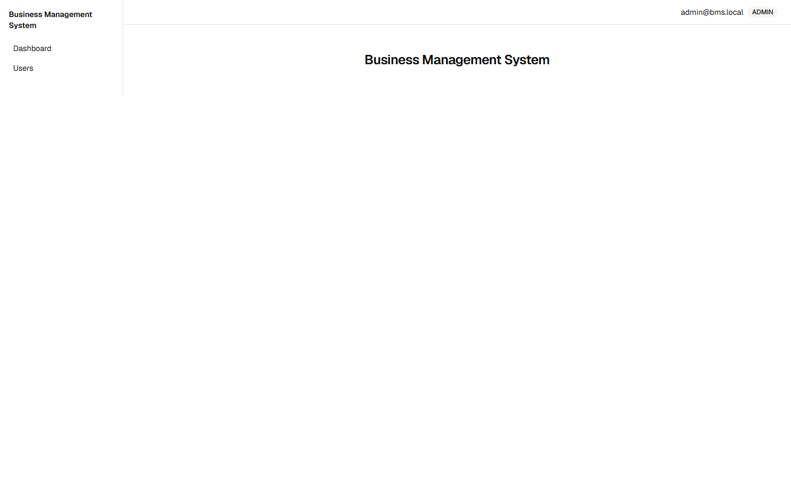

# Business Management System

Portfolio project: B2B wholesale distributor management system.

- **Backend:** Java + Spring Boot (REST)
- **Frontend:** Next.js + TypeScript + shadcn/ui (App Router)
- **Database:** PostgreSQL + Flyway
- **Auth:** Stateless JWT in httpOnly cookie, role-based (`ADMIN`, `MANAGER`, `EMPLOYEE`)
- **Environment:** Local-first (`docker compose`), seed data included. Free-tier deploy documented as optional.

## What this system is

A fictional Brazilian B2B wholesaler (BRL, CPF/CNPJ-style documents; code/docs/UI in English) that buys products from suppliers and resells to business customers on **credit terms (net-30 default)**.

Core flow:

```text
Supplier → Purchase Order → Inventory (movement ledger) → Sales Order → Invoice → Payment → Dashboard
```

Depth is concentrated on **orders, inventory, and finance**. All other modules are honest and shallow. See `docs/development/roadmap.md` for the phased plan and `docs/domain/business-rules.md` for the rules that make this more than CRUD.

## Quick start

```sh
docker compose up -d      # postgres (healthcheck; data persists in the db-data volume)
./mvnw spring-boot:run    # backend on :8080 — verify with GET /actuator/health
./mvnw test               # integration tests against Testcontainers PostgreSQL (never H2)
```

Backend environment overrides: `DB_URL` / `DB_USER` / `DB_PASSWORD` (defaults match compose), and `SERVER_PORT` when 8080 is taken. Flyway migrates automatically on every boot; re-boots are a no-op.

### Demo the auth (seeded admin)

Migration V2 seeds an admin so a fresh clone can log in with zero configuration. The credentials below are a **local demo default — never deploy as-is**; set `ADMIN_EMAIL` / `ADMIN_PASSWORD` (applied at boot) before any shared environment.

```sh
curl -i -c jar.txt -X POST http://localhost:8080/api/auth/login \
  -H 'Content-Type: application/json' \
  -d '{"email":"admin@bms.local","password":"admin123"}'   # 200 + Set-Cookie: access_token=…; HttpOnly
curl -b jar.txt http://localhost:8080/api/auth/me          # {"email":"admin@bms.local","role":"ADMIN"}
curl -i -X POST http://localhost:8080/api/auth/login \
  -H 'Content-Type: application/json' \
  -d '{"email":"admin@bms.local","password":"wrong"}'      # 401 application/problem+json
```

### Run the frontend (web)

```sh
npm install                                   # once, at the repo root (npm workspaces)
npm run dev --workspace web                   # Next.js on :3000 — log in with the seeded admin
```

Open http://localhost:3000 — an unauthenticated visit redirects to `/login?next=…`; logging in as the seeded admin lands on `/` with the role shown in the shell header, and the session (httpOnly cookie) survives a refresh:



The UI talks straight to the API (no BFF), so it needs the API base URL when it isn't the documented `:8080` default: `API_BASE_URL` (server-side) or `NEXT_PUBLIC_API_BASE_URL` (browser bundle). E.g. with the backend on `:8081`: `NEXT_PUBLIC_API_BASE_URL=http://localhost:8081 npm run dev --workspace web`. CORS allows exactly `http://localhost:3000` with credentials (ADR 0015).

## Docs

```text
GLOSSARY.md                        # canonical domain language
docs/
├── requirements/requirements.md
├── architecture/architecture.md
├── adr/                           # ~15 decision records
├── domain/domain-model.md
├── domain/business-rules.md
├── database/database-design.md
├── api/api-design.md
├── frontend/frontend-architecture.md
├── testing/testing-strategy.md
└── development/roadmap.md
```

Start with `docs/requirements/requirements.md`, then `docs/domain/domain-model.md` + `docs/domain/business-rules.md`.

## Design highlights (interview stories)

- Inventory is an **append-only movement ledger**, not a stock column (ADR-006).
- Orders **reserve at CONFIRMED, decrement at PROCESSING**; order status is **independent of payment status** (ADR-007, ADR-008).
- Invoices issue **once, at COMPLETED**; cancel ≠ return (ADR-009, ADR-010).
- Cost is a **weighted average + per-item snapshot**; profit = gross margin − opex (ADR-011).
- Money moves are **cash-only transactions**; corrections are **VOID + re-enter**, never edits (ADR-012, ADR-013).
- Backend enforces permissions with **`@PreAuthorize`**; frontend hiding is UX only.
- Errors are **RFC 9457 problem+json** with a 400 / 409 / 422 split.
